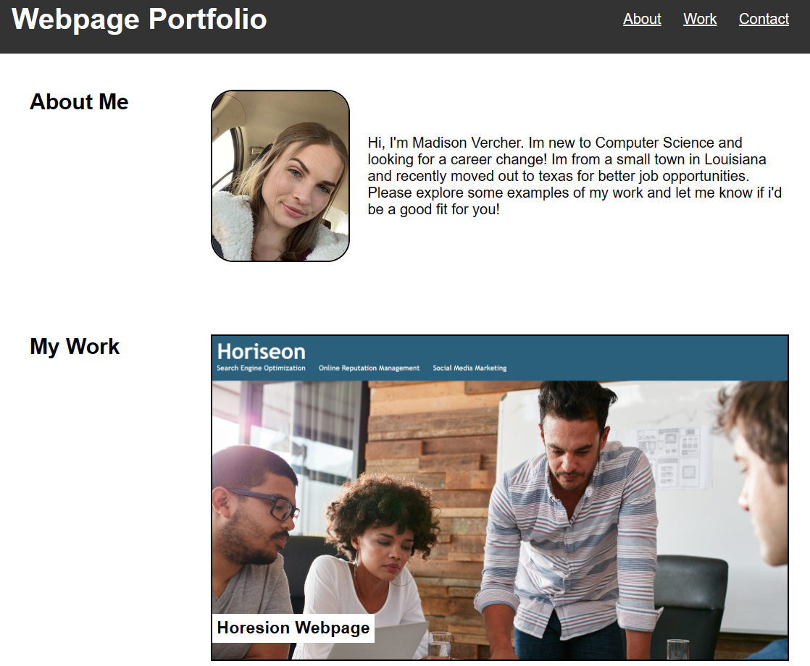

## Job Portfolio Webpage

## Description
I've created a webpage with a 'about me' section, a 'my work' section, and a 'contact' section. The about me is just a breif description of my life and how i got started in this progam, the my work section displays my projects ive already created, and the contact section is just a way to reach out to me. 

## Usage
This webpage will hopefully be used by future employers to be able to see the work I have created and decide if I will be a good fit for their company.

## Deployed URL for webpage 
https://madiemalee.github.io/Job-Portfolio/

## Webpage Output 

